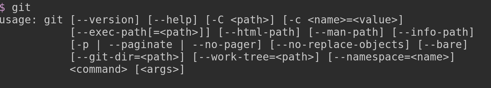

# Set Up Your Environment

### Step 1: Git

Git is the primary collaboration software for software development -- like Google Docs for programmers.

To check whether you have it installed go to your terminal, type “git” and hit enter. If you don’t see a bunch of instructions (see pic below), you don’t have git installed and need to install [Git](https://git-scm.com/book/en/v2/Getting-Started-Installing-Git)




### Step 2: Python

Go to your terminal, type “python3” and hit enter. If you don’t see a “python prompt” (see pic below) then you need to [install Python 3](https://docs.python-guide.org/starting/installation/). Hit control-d or call the python `exit()` function to exit.


### Step 3: Clone the Project with Git, install dependencies, and run it

For Mac / Linux, open your terminal and execute the following commands:

```
git clone https://github.com/jakobalexander/from-secret-to-signed-transaction
cd from-secret-to-signed-transaction
python3 -m venv venv
source venv/bin/activate
python3 -m pip install -r requirements.txt
jupyter notebook
```

For Windows, there are 2 options. I recommend you install the [Windows Linux Subsystem](https://docs.microsoft.com/en-us/windows/wsl/install-win10) and follow the instructions above. Another option is to open PowerShell and execute the following commands:

```
git clone https://github.com/superquest/digital-cash.git
cd .\digital-cash\
py -m venv venv
.\venv\Scripts\activate
python -m pip install --upgrade pip
python -m pip install -r .\requirements.txt
jupyter notebook
```

This will open up your web browser to a page that looks like the image below. This is [Jupyter Notebook](http://jupyter.org/), which is basically a little website that’s run on only your computer.

Click the "From_Secret_To_Signed_Transaction_Workbook.ipynb" link to follow along with this first lesson.
